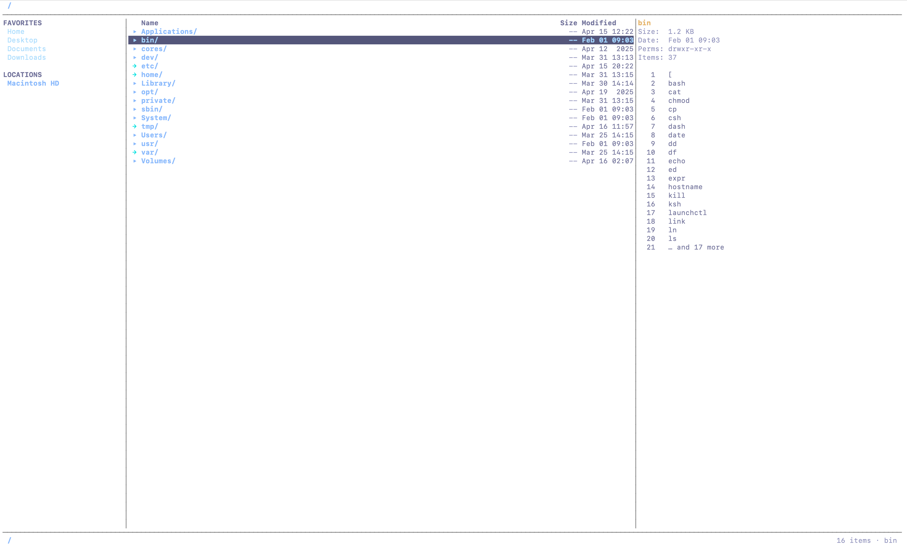

<div align="center">
  <h1>Tuiple 📁</h1>
  <p>A fast, modern, and beautiful Terminal User Interface (TUI) file manager written in Go.</p>
</div>



## 🌟 About Tuiple

**Tuiple** is designed for power-users who want the speed of the terminal without sacrificing aesthetics and essential quality-of-life features. Built with `Bubble Tea` and styled with `Lip Gloss`, it features a clean layout, deep integration with your OS, and native integration into modern light/dark terminal color palettes.

### ✨ Key Features

- **Modern UI:** Unobtrusive three-panel layout (Sidebar, File List, File Preview) that intelligently conforms to your terminal.
- **Smart Navigation:** Intuitive arrow key navigation with instant directory jumps. 
- **Lightning Fast Search Engine:** 
- **Fuzzy Name Search** (`f`): Rapidly find files nested up to 4 directories deep.
- **Content Search** (`F`): RipGrep-style full text search inside your documents.
- **Bookmarks:** Save any directory to Favorites (`'`) and jump across the galaxy instantly.
- **Multi-Select & Bulk Operations:** Mark dozens of files with `<Space>` and Copy/Cut/Delete them instantly.
- **Safe Operations & History:** Full Undo/Redo stack (`u`/`U`) for file actions, including a 20-second soft-delete mechanism to prevent accidental data loss.
- **Rich File Previews:** Look at file contents with syntax-like colors for specific extensions without opening them.
- **Media Previews:** Native image, video thumbnail, and PDF rendering directly in the terminal using Unicode half-blocks.
- **Terminal Image Viewer:** Open images in high quality directly in your terminal using `chafa`.
- **E-Book & Document Reader:** Native integration with `bookokrat` for reading PDF, EPUB, and DJVU files without leaving the terminal.
- **Built-in Audio Player:** Play MP3, FLAC, WAV, AAC, OGG and more right from the file manager with progress bar, seeking, and metadata display.
- **Instant Shell Drops:** Press `S` to pause Tuiple, drop seamlessly into a robust bash/zsh shell to execute commands, and instantly teleport right back.
- **Mouse Support:** Scroll through everything using native touchpad/mouse wheel bindings!

---

## 💻 Installation

Make sure you have [Go](https://golang.org/dl/) 1.21+ installed.

```bash
# Clone the repository
git clone https://github.com/JohnnyReverb9/tuiple.git
cd tuiple

# Build the project
go build -o tuiple .

# Run the app
./tuiple [optional/start/path]
```

---

## ⌨️ Global Keyboard Shortcuts

**Navigation**
| Key | Action |
| --- | --- |
| `↑` | Move cursor up |
| `↓` | Move cursor down |
| `Enter` / `→` | Enter directory / **Open file** |
| `Backspace` / `←` | Go back to parent directory |
| `g` / `G` | Jump to the very top / bottom |
| `Ctrl+u` / `Ctrl+d` | Page up / Page down |
| `~` | Fly to Home directory |
| `Tab` / `Shift+Tab` | Switch focus between panels |

**File Operations**
| Key | Action |
| --- | --- |
| `Space` | Toggle multi-selection on file |
| `Esc` | Clear all selections |
| `c` / `x` / `p` | Copy / Cut / Paste |
| `d` | Delete the selected file(s) |
| `u` / `U` | Undo / Redo last file operation |
| `r` | Rename current file |
| `n` / `N` | Create new File / new Directory |

**Search & Bookmarks**
| Key | Action |
| --- | --- |
| `f` | Open Fuzzy File Search (by name) |
| `F` | Open Full-Text Search (in contents) |
| `/` | Live list filter |
| `'` | (Un)Bookmark current path to Favorites |

**Audio Player** *(when an audio file is selected)*
| Key | Action |
| --- | --- |
| `l` | Play / Pause audio |
| `-` / `=` | Seek backward / forward 5 seconds |
| `_` / `+` | Seek backward / forward 30 seconds |

**System & Sorting**
| Key | Action |
| --- | --- |
| `.` | Toggle hidden files display |
| `o n` / `o s` / `o d`| Sort by: Name / Size / Date |
| `S` | Drop to Subshell (`sh`/`bash`/`zsh`) |
| `?` | Show comprehensive Help screen |
| `q` / `Ctrl+c` | Quit Tuiple |

---

## 📦 Optional Dependencies

To unlock the full potential of Tuiple, it is recommended to install the following utilities:

| Tool | Used for |
| --- | --- |
| `chafa` | **High-quality Image & Video viewing** in the terminal. |
| `bookokrat` | **Terminal E-book reader** (PDF, EPUB, DJVU). |
| `pdftotext` | Fallback text extraction for PDF files. |
| `ffmpeg` | Video thumbnails, audio seeking. |
| `afplay` | Audio playback (macOS built-in). |
| `afinfo` | Audio metadata parsing (macOS built-in). |

> **Tip:** On macOS, you can install most of these via Homebrew: `brew install chafa ffmpeg poppler`. `bookokrat` can be found on its GitHub repository.

---

## 🗃️ Configuration

Tuiple automatically saves persistent runtime logic into `~/.config/tuiple/`.
- **Bookmarks:** Found in `~/.config/tuiple/bookmarks.json`.

---

<p align="center">
  <i>Made with ❤️ by JohnnyReverb9. Built on top of Charm.sh ecosystem.</i>
</p>
